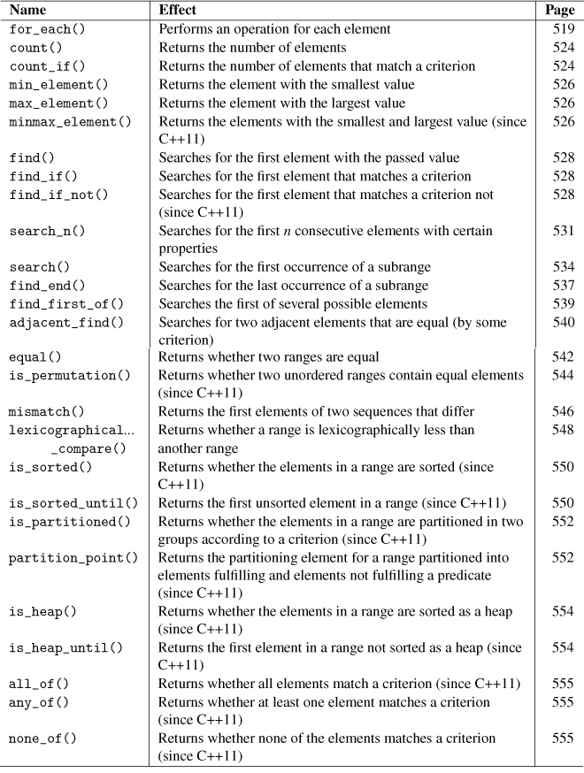
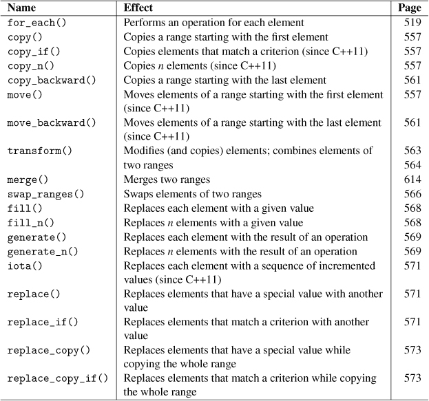
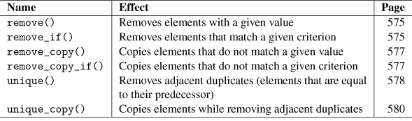
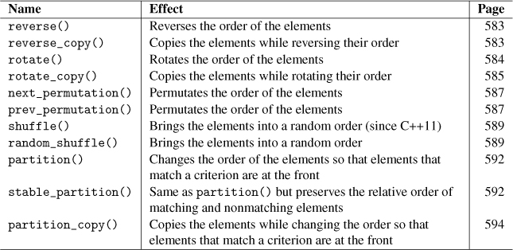
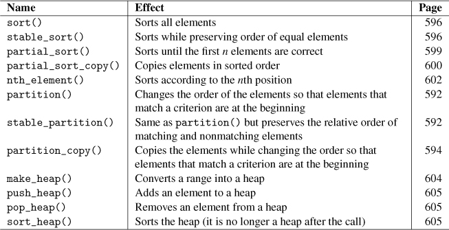
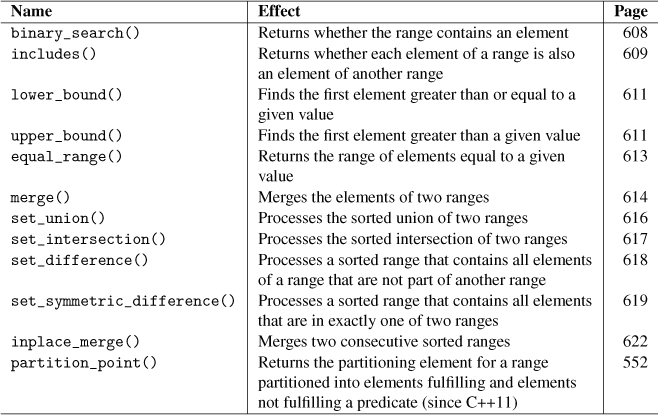
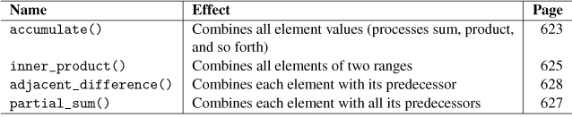
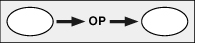
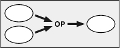

+ nonmodifying algorithms
  + details
  
+ modefying algorithms
  + details
  
+ removing algorithms
  + only overwriting elements
  + return new "end" of the range
  + details
  
+ mutating
  + change the order of elements
  + details
  
+ sorting
  + change the order of elements
  + a sepcial kind of mutating algorithms
  + details
  
  + algorithms for sorted ranges
  
+ numeric algorithms
  + details
  
+ is_permutation
  + use is_permutation to determine whether two container have same elements or not
+ transform
  + transform(): four parameters version and five parameters version
  
  
+ generate
  + assign the values that are generated by the call of op()
  ```cpp
  void generate(ForwardIter beg, ForwardIter end, Func op)
  void generate_n(ForwardIter beg, Size num, Func op)
  ```
+ iota
+ permutate elements
  + next_permutation()
  + prev_permutation()
+ shuffle elements
  + shuffle()
  + random_shuffle()
+ set operation
  + union
  + intersection
  + difference
+ accumulate
  + initVal = op(initVal, elem)
+ inner_product
  + initVal = op1(initVal, op2(elem1, elem2))
+ partial_sum
  + a1, op(a1, a2), op(a1, a2, a3), op(a1, a2, a3, a4), ...
+ adjacent_difference
  + a1, op(a2, a1), op(a3, a2), op(a4, a3), ...