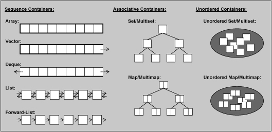
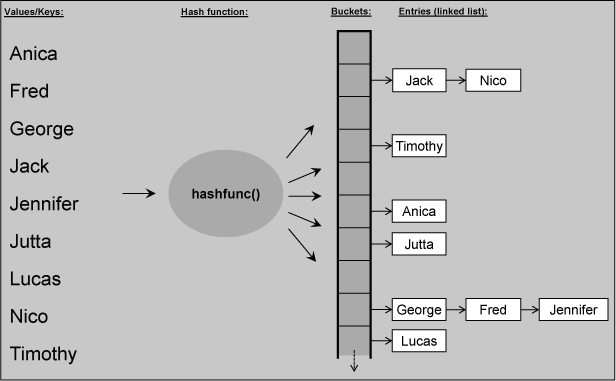

+ key components:   
  + iterators
  + containers
  + algorithms
  + the data is managed by container classes
  + the operations are defined by configurable algorithms
  + And iterators are the glue between containers and algorithms
+ containers
   
  + sequence container: array, vector, deque, list, forward_list
  + associative containers: set, multiset, map, multimap
  + unordered containers: unordered_(set, multiset, map, multimap)
  + *array* manages its elements in an array of fixed size: *static-array,* *C-array*
  
  + when using unordered map and other associative containers, a new index (or key) is taken as a reason to create and insert a new map element that has the index as the key. Thus, you can't have an invalid index error. --> vs. *.at()*
+ other containers
  + strings
  + ordinary c-style array: are not STL containers, but you can call algorithms for them
  + stack
  + (priority) queue
+ iterators
  + *container::iterator* --> read and write
  + *container::const_iterator* --> read only
  + *iter++* is slightly slower than *++iter*
+ algorithms
  + every algorithm processes half-open ranges: [begin, end)
  + make sure the *range* valid is not a simple thing
+ istream_iterator and ostream_iterator
+ function object or functor
  + *operator()* in class
  + *smarter* than oridinary function
  ```cpp
  class AddValue{
    private:
        int the_value_;
    public:
        AddValue(int v):the_value_(v){}
        void operator()(int& elem) const {
            elem += the_value_;
        }
  };

  std::for_each(data.begin(), data.end(), AddValue(10));

  AddValue addx(-1);
  AddValue addy(1);
  std::for_each(data.begin(), data.end(), addx);
  std::for_each(data.begin(), data.end(), addy);
  ```
  + predefined function objects
  ```cpp
  std::negate<>()
  std::multiple<>()
  std::equal_to<>()
  ```
  + using binder to make function objects