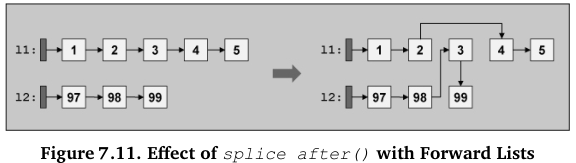
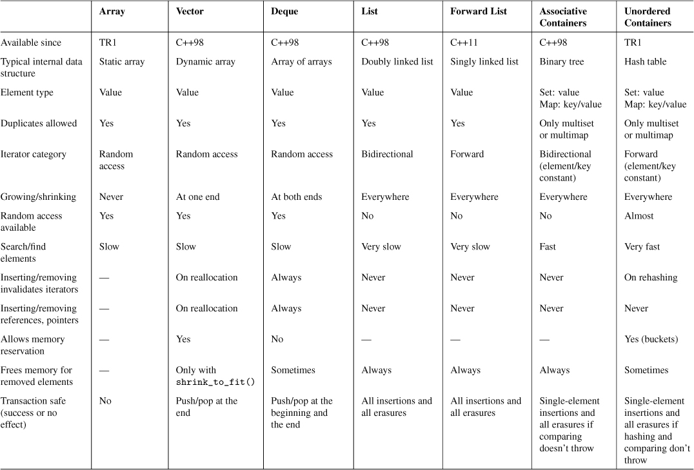

+ common container abilities and operations
+ arrays
  + memory is allocated on the stack (if possible)
  + after *std::swap()*, the content before is undefined
  + use *.fill()* to assign value to each element in array
  + access element
  ```cpp
  array[index] // no range checking
  array.at(index) // throws range-error exception when out of range
  ```
  + iterators
  ```cpp
  array.begin()
  array.cbegin()
  array.rbegin()
  array.crbegin()

  array.end()
  array.cend()
  array.rend()
  array.crend()
  ```
  + guarantees that the elements are in contiguous memory
  ```cpp
  array.data() // direct access the element in the array, equal to &a[0]
  ```
+ vectors
  + a vector models a dynamic array
  + an additional "size" operation is the *.capacity()*: if you exceed the capacity, the vector has to reallocate its internal memory
  + use *.reserve()* to ensure a certain capacity before you really need it
  + use *.assign()* to be a copy of other container content
  + common operators
  ```cpp
  vec.push_back(elem)
  vec.pop_back()
  vec.insert(pos, elem)
  vec.insert(pos, n, elem)
  vec.insert(pos, intilist)
  vec.emplace(pos, args...)
  vec.emplace_back(args...)
  vec.erase(pos)
  vec.erase(beg, end)
  vec.resize(num)
  vec.resize(num, elem)
  vec.clear()

  std::vector<char, 40> v;
  printf("%s\n", v.data());
  ```
  + *std::vector<bool>* is special container optimized with bool type
  ```cpp
  c.flip()
  c[idx].flip()
  c[idx] = val
  ```
  + but if you need a bitfited with static size, chose *bitset* rather than *vector<bool>*
+ deques
  + compared to vector, deque is fast for insertions and deletions at both the end and the beginning
  + is similar to vector
+ lists
  + each element has two pointers, which refer to the previous and the next element
  + deletions and insertions are fast at anywhere
  + some important operations
  ```cpp
  c.push_front()
  c.pop_front()
  c.unique()
  c.splice()
  c.sort()
  c.merge()
  c.reverse()
  ```
  + it is important to know that there are difference and similarity between STL container class member functions and STL algorithms
+ forward_list
  + singly linked list: can not iterate backward
  + only access element with *.front()*
  + two special member functions
  ```cpp
  // using any oridinary algorithm with before_begin() as first argument passed results in a runtime error
  c.before_begin() // return a forward iterator for the position before the first element
  c.cbefore_begin()
  ```
  + insert and remove operations
  ```cpp
  c.push_front() // there is no push_back()
  c.pop_front()  // there is no pop_back()
  c.insert_after()
  c.emplace_after()
  c.emplace_front()
  c.erase_after()
  c.remove()
  c.remove_if()
  c.clear()
  c.resize()

  c.splice_after()
  c.unique()
  c.sort()
  c.merge()
  c.reverse()
  ```
  
  + you can define two useful template functions to work with forward_list: *find_before* and *find_before_if*
  ```cpp
  template <typename InputIterator, typename Tp>
  inline InputIterator find_before(InputIterator first, InputIterator last, const Tp& val)
  {
    if (first == last)
    {
        return first;
    }
    InputIterator next(first);
    ++next;
    while(next != last && !(*next==val))
    {
        ++next;
        ++first;
    }
    return first;
  }


  template <typename InputIterator, typename Pred>
  inline InputIterator find_before_if(InputIterator first, InputIterator last, Pred pred)
  {
    if (first == last)
    {
        return first;
    }
    InputIterator next(first);
    ++next;
    while(next != last && !(pred(*next)))
    {
        ++next;
        ++first;
    }
    return first;
  }
  ```
+ sets and multisets
  + if a special sorting criterion is not passed, the default criterion is *std::less<T>*
  + sets and multisets are usually implemented as balanced binary trees
  + are specially optimized for fast searching of elements
  ```cpp
  c.count(val)
  c.find(val)
  c.lower_bound(val) // --> the first position of the first element >= val
  c.upper_bound(val) // --> the last position of the first element > val
  c.equal_range(val)
  /*
  set<int> --> 1, 2, 4, 5, 6
  lower_bound(5) --> 5
  upper_bound(5) --> 6
  equal_range(5) --> 5, 6
  */
  ```
+ maps and multimaps
  + the element type is a *pair<const Key, T>*
  + are usually implemented as balanced binary trees
  + if use algorithms and lambdas to operate with the elements of a map, you explictly have to declare the element type
  ```cpp
  std::map<std::string, float> map;
  // ...
  std::for_each(map.begin(), map.end(), [](std::pair<const std::string. float>& elem){
    elem.second += 10;
    });
  ```
  + simply modify the key of an element
  ```cpp
  map["new_key"] = map["old_key"]
  map.erase("old_key")
  ```
+ unordered containers
  + use the default hash function *std::hash<>* from *<functional>*
  + difference between rehash and reserve
  ```cpp
  col.rehash(100); // prepare for 100 / max_load_factor() element
  col.reserve(100); // prepare for 100 element
  ```
+ implementing reference semantics
  + use shared pointers: *shared_ptr<>*
  ```cpp
  class MyClass{
    public:
      // ...
    private:
      // ...
  };

  using MyClassPtr = std::shared_ptr<MyClass>;
  std::set<MyClassPtr> my_classes {
    MyClassPtr(new MyClass{...}),
    MyClassPtr(new MyClass{...}),
    ...
  };
  ```
  + use a reference warpper
  ```cpp
  std::vector<std::reference_warpper<MyClass>> my_second_classes;
  MyClass test;
  my_second_classes.push_back(test); // insert test into my_second_classes by reference
  // now you can modify content from test, and the corresponding content in vector is modified
  ```
+ how to choose which container
  + overview of container abilities
  