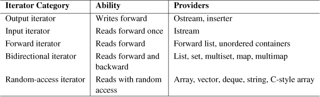

+ some auxiliary iterator functions are introduced by: *<iterator>*
+ iterators categories

+ auxiliary iterator functions
  + advance()
  ```cpp
  #include <iterator>
  void advance(InputIterator& pos, Dist n) // lets the input iterator pos step n elements forward or backward
  ```
  + next()
  ```cpp
  ForwardIterator next (ForwardIterator pos)
  ForwardIterator next (ForwardIterator pos, Dist, n)
  ```
  + prev()
  ```cpp
  ForwardIterator prev (ForwardIterator pos)
  ForwardIterator prev (ForwardIterator pos, Dist, n)
  ```
  + distance()
  ```cpp
  Dist distance (InputIterator pos1, InputIterator pos2)
  ```
  + iter_swap()
+ iterator adapters
  + reverse iterators